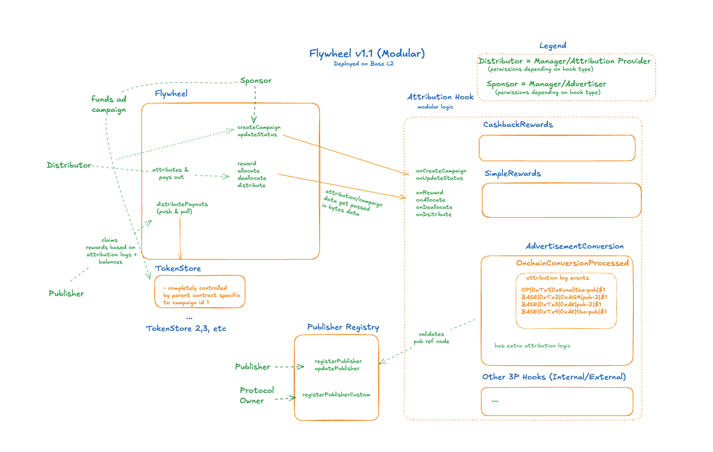

# Flywheel Protocol

TLDR:

- A modular, permissionless protocol for transparent attribution and ERC20 reward distribution
- Enables any relationship where Users/Publishers drive conversions and get rewarded by Sponsors through various validation mechanisms
- Flexible hooks system supports diverse campaign types: advertising (AdConversion), e-commerce cashback (CashbackRewards), and custom rewards (SimpleRewards)
- Permissionless architecture allows third parties to create custom hooks for any use case
- Each hook can customize payout models, fee structures, and attribution logic while leveraging the core Flywheel infrastructure for secure token management

## Overview

Flywheel Protocol creates a decentralized incentive ecosystem where:

- **Sponsors** create campaigns and fund them with tokens (advertisers, platforms, DAOs, etc.)
- **Publishers (Optional)** drive traffic and earn rewards based on performance (only in AdConversion campaigns)
- **Attribution Providers** track conversions and submit verified data that triggers payouts to earn fees (only in AdConversion campaigns)
- **Managers** control campaign operations and submit payout data (in CashbackRewards and SimpleRewards campaigns)
- **Users** can receive incentives for completing desired actions across all campaign types

The protocol uses a modular architecture with hooks, allowing for diverse campaign types without modifying the core protocol.

## Architecture

**Core Design Principles**

- Modular design with hooks for extensibility
- Core `Flywheel.sol` protocol handles only essential functions
- Campaign-specific logic isolated in hook contracts (i.e. `AdConversion.sol` and `CashbackRewards.sol` that are derived from `CampaignHooks.sol`)
- Clean separation between protocol and implementation

## Architecture Diagram



The diagram above illustrates how the modular Flywheel v1.1 architecture works:

- **Core Flywheel Contract**: Manages campaign lifecycle and payouts
- **Campaign**: Each campaign has its own isolated address for storing tokens
- **Campaign Hooks**: Pluggable logic for different campaign types
- **BuilderCodes**: Optional referral code system, initially used for publisher-based campaigns
- **Participants**: Shows the flow between sponsors and recipients based on hook-specific validation

## Core Data Structures

**Payout**: Direct token transfer to a recipient

```solidity
struct Payout {
    address recipient;  // Address receiving the payout
    uint256 amount;     // Amount of tokens to be paid out
    bytes extraData;    // Extra data for the payout
}
```

**Allocation**: Reserved payout identified by a key for future distribution

```solidity
struct Allocation {
    bytes32 key;        // Key for the allocation
    uint256 amount;     // Amount of tokens to be allocated
    bytes extraData;    // Extra data for the allocation
}
```

**Distribution**: Claiming of allocated tokens identified by key to a recipient

```solidity
struct Distribution {
    address recipient;  // Address receiving the distribution
    bytes32 key;        // Key for the allocation being distributed
    uint256 amount;     // Amount of tokens to be distributed
    bytes extraData;    // Extra data for the distribution
}
```

## Core Components

#### 1. **Flywheel.sol** - Core Protocol

The main contract that manages:

- Campaign lifecycle (Inactive → Active → Finalizing → Finalized)
- Reward, allocation, distribution, and deallocation of payouts
- Enhanced fee collection and distribution with `bytes32` key support
- Campaign deployment for each campaign
- Key-based allocation system for flexible payout tracking

#### 2. **Campaign.sol** - Campaign Treasury

- Holds campaign funds (ERC20 tokens)
- Deployed via clones for gas efficiency
- Controlled by Flywheel contract
- One Campaign per campaign for isolation

#### 3. **CampaignHooks** - Extensibility Layer

Abstract interface that enables:

- Custom campaign logic
- Access control rules
- Attribution calculations
- Metadata management

#### 4. **BuilderCodes.sol** - Publisher & Ref Code Management

- Publisher registration and ref code generation
- Relevant to `AdConversion.sol` for Spindl/Base Ads and other open-ended use cases
- Payout address management
- Multi-chain publisher identity
- Backward compatible with existing publishers

#### 5. **PseudoRandomRegistrar.sol** - Permissionless Code Generation

- Enables permissionless registration of referral codes with auto-generated identifiers
- Generates 8-character codes using pseudo-random algorithm based on nonce and timestamp
- Uses allowed character set from BuilderCodes for compatibility
- Automatically retries if generated code already exists or is invalid
- Provides alternative to custom code registration for users who don't need specific codes

## Referral Code System

The Flywheel Protocol includes a comprehensive referral code system that enables identity management and attribution tracking across campaigns for any type of participant. While publishers are the primary users in AdConversion campaigns, the registry is designed as a general-purpose identity system that builders, creators, liquidity providers, and other participant types can utilize. Referral codes are implemented as ERC721 tokens, making them tradeable assets with built-in ownership and metadata capabilities.

### Overview

Referral codes serve as unique identifiers for any campaign participant and can be used across different campaign types for attribution and reward distribution. **Publishers are just one type of user** - the system is designed to support builders, creators, liquidity providers, and any other participant type that future hooks might need. The system supports both custom-branded codes and auto-generated random codes, providing flexibility for different use cases.

**Key Features:**

- **ERC721 Implementation**: Each referral code is a unique NFT with transferable ownership
- **Payout Address Management**: Codes map to payout addresses for reward distribution
- **Multi-Chain Identity**: Single code can represent publisher across different chains
- **Custom or Random Generation**: Support for branded codes and permissionless random codes
- **Hook Integration**: Extensible system that any campaign hook can utilize

### Registration Methods

#### 1. Custom Code Registration

Any participant (publishers, builders, creators, etc.) can register memorable, branded referral codes through the BuilderCodes contract:

```solidity
// Register custom code "base"
referralCodes.register(
    "base",                           // Custom referral code
    0x1234...5678,                   // Initial owner
    0xabcd...efgh                    // Payout address
);
```

**Custom Code Examples:**

- `"base"` - Brand/organization name
- `"alice123"` - Publisher/builder username
- `"crypto_news"` - Content creator category
- `"defi_builder"` - Builder specialization
- `"spring2024"` - Campaign-specific code

**Requirements for Custom Codes:**

- Must contain only allowed characters: `0123456789abcdefghijklmonpqrstuvwxyz_`
- Cannot be empty
- Must be unique across the entire system
- Requires `REGISTER_ROLE` permission or valid signature

#### 2. Permissionless Random Code Registration

Users can generate random codes through the PseudoRandomRegistrar without requiring permissions:

```solidity
// Generate random 8-character code
string memory randomCode = pseudoRandomRegistrar.register(
    0xabcd...efgh  // Payout address
);
// Returns something like: "sdf34433"
```

**Random Code Examples:**

- `"sdf34433"` - 8 characters, pseudo-random
- `"x9k2m7q1"` - Another random variation
- `"pq84nz3v"` - Auto-generated unique code

**Random Generation Algorithm:**

```solidity
// Simplified version of the generation logic
function computeCode(uint256 nonce) public view returns (string memory) {
    uint256 hashNum = uint256(keccak256(abi.encodePacked(nonce, block.timestamp)));
    bytes memory codeBytes = new bytes(8);

    for (uint256 i = 0; i < 8; i++) {
        codeBytes[i] = allowedCharacters[hashNum % allowedCharacters.length];
        hashNum /= allowedCharacters.length;
    }

    return string(codeBytes);
}
```

### Current Usage in AdConversion Campaigns

The AdConversion hook leverages referral codes for publisher attribution and validation. Note that **publishers are the specific participant type** for AdConversion campaigns, but other hooks could use the same registry for different participant types (like builders):

```solidity
// Example AdConversion attribution
Conversion memory conversion = Conversion({
    eventId: "unique-event-id",
    clickId: "click-12345",
    configId: 1,
    publisherRefCode: "base",        // Must exist in BuilderCodes
    timestamp: uint32(block.timestamp),
    payoutRecipient: address(0),     // Use registry lookup
    payoutAmount: 10e18
});
```

**AdConversion Validation Process:**

1. **Code Existence Check**: Verifies `publisherRefCode` exists in BuilderCodes registry
2. **Allowlist Validation**: If campaign has allowlist, checks if publisher is approved
3. **Payout Address Resolution**:
   - If `payoutRecipient = address(0)`: Look up via `referralCodes.payoutAddress(publisherRefCode)`
   - If `payoutRecipient` specified: Use direct address (with ownership validation)
4. **Attribution Fee Calculation**: Deduct provider fees from publisher payout

**Publisher Allowlist Examples:**

```solidity
// Restricted campaign - only specific publishers
string[] memory allowedRefCodes = ["base", "alice123", "crypto_news"];

// Open campaign - any registered publisher
string[] memory allowedRefCodes = []; // Empty array = no restrictions
```

## Hook Examples

- hooks must be derived from `CampaignHooks.sol`
- for v1, we ship `AdConversion.sol`, `CashbackRewards.sol`, and `SimpleRewards.sol` but the system enables anyone to create their own hook permissionlessly (whether internal at Base or external). For instance, internally in near future if we choose to support Solana conversion events or Creator Rewards, we can deploy a new Campaign Hook that fits the specific requirements and utilize `Flywheel` core contract for managing payouts

### **AdConversion.sol**

Traditional performance marketing campaigns where publishers drive conversions and earn rewards.

**Core Features:**

- Publishers earn based on verified conversions
- Supports both onchain and offchain attribution events
- Configurable conversion configs with metadata
- Publisher allowlists for restricted campaigns
- Attribution fee collection for providers
- Attribution deadline duration must be in days precision (0 days for instant finalization, or multiples of 1 day)
- Attribution window must be between 0 and 6 months (180 days maximum)

**Campaign Creation:**

```solidity
bytes memory hookData = abi.encode(
    attributionProvider,    // Who can submit conversions
    advertiser,            // Campaign sponsor
    "https://api.spindl.xyz/metadata/...",    // Campaign metadata URI
    allowedRefCodes,       // Publisher allowlist (empty = no restrictions)
    conversionConfigs,     // Array of ConversionConfig structs
    attributionWindow  // Duration for attribution finalization (must be in days precision: 0, 1 day, 2 days, etc.; max 180 days)
);
```

**Common Reward Scenarios:**

1. **Publisher-Only Rewards (Direct Payout)**

   ```solidity
   Conversion memory conversion = Conversion({
       eventId: "unique-event-id",
       clickId: "click-12345",
       configId: 1,
       publisherRefCode: "publisher-123",
       timestamp: uint32(block.timestamp),
       payoutRecipient: 0x1234...5678,  // Direct payout address
       payoutAmount: 10e18  // 10 tokens
   });
   ```

   - Payout goes directly to specified `payoutRecipient`
   - Useful when publisher wants specific address for rewards
   - Attribution fee deducted from `payoutAmount`

2. **BuilderCodes Lookup**

   ```solidity
   Conversion memory conversion = Conversion({
       eventId: "unique-event-id",
       clickId: "click-12345",
       configId: 1,
       publisherRefCode: "publisher-123",
       timestamp: uint32(block.timestamp),
       payoutRecipient: address(0),  // Use registry lookup
       payoutAmount: 10e18
   });
   ```

   - When `payoutRecipient = address(0)`, system looks up publisher's payout address
   - Uses `referralCodeRegistry.getPayoutRecipient(refCode)`
   - Allows publishers to manage payout addresses centrally
   - Supports multi-chain publisher identity

3. **Onchain vs Offchain Conversions**

   ```solidity
   // Offchain conversion (e.g., email signup, purchase)
   Attribution memory offchainAttr = Attribution({
       conversion: conversion,
       logBytes: ""  // Empty for offchain events
   });

   // Onchain conversion (e.g., DEX swap, NFT mint)
   Log memory logData = Log({
       chainId: 8453,  // Base
       transactionHash: 0xabcd...,
       index: 2
   });
   Attribution memory onchainAttr = Attribution({
       conversion: conversion,
       logBytes: abi.encode(logData)  // Log data for verification
   });
   ```

4. **Conversion Config Validation**

   - `conversionConfigId = 0`: No validation, accepts any conversion type
   - `conversionConfigId > 0`: Must match registered config
     - Validates `isEventOnchain` matches presence of `logBytes`
     - Config must be active (`isActive = true`)
     - Used to enforce conversion type requirements

5. **Publisher Allowlist**

   ```solidity
   // Campaign with allowlist (only specific publishers)
   string[] memory allowedRefCodes = ["publisher-123", "publisher-456"];

   // Campaign without allowlist (any registered publisher)
   string[] memory allowedRefCodes = [];
   ```

   - Empty allowlist = any registered publisher can earn
   - Non-empty allowlist = only specified publishers allowed
   - Advertiser can add publishers via `addAllowedPublisherRefCode()`

6. **Attribution Fee Structure**

   ```solidity
   // Attribution provider sets their fee (0-100%)
   attributionProvider.setAttributionProviderFee(100); // 1% fee

   // During payout:
   uint256 attributionFee = (payoutAmount * feeBps) / 10000;
   uint256 netPayout = payoutAmount - attributionFee;
   ```

   - Attribution providers earn fees for verification work
   - Fee deducted from publisher payout, not campaign funds
   - Currently set to 0% for Base/Spindl campaigns

7. **Attribution Deadline Duration**

   ```solidity
   // Instant finalization (no delay between FINALIZING and FINALIZED)
   uint48 attributionWindow = 0;

   // 7-day attribution window
   uint48 attributionWindow = 7 days;

   // 30-day attribution window
   uint48 attributionWindow = 30 days;

   // Maximum allowed: 6 months (180 days)
   uint48 attributionWindow = 180 days;

   // Invalid: Exceeds 6-month limit
   // uint48 attributionWindow = 365 days;  // ❌ Reverts
   // uint48 attributionWindow = 200 days;  // ❌ Reverts

   // Invalid: Not in days precision
   // uint48 attributionWindow = 3 hours;  // ❌ Reverts
   // uint48 attributionWindow = 2 days + 5 hours;  // ❌ Reverts
   ```

   - Must be in days precision (0, 1 day, 2 days, etc.)
   - Must be between 0 and 180 days (6 months maximum)
   - 0 means instant finalization when entering FINALIZING state
   - Non-zero values create a waiting period before advertiser can finalize
   - Prevents UI complexity from inconsistent time formats
   - Prevents unreasonably long finalization delays

**Validation Rules:**

- Publisher ref code must exist in `BuilderCodes`
- If allowlist exists, publisher must be approved
- Conversion config must be active (if specified)
- Conversion type must match config (onchain/offchain)
- Only attribution provider can submit conversions
- Only advertiser can withdraw remaining funds (when finalized)

**State Transition Control:**

- **Attribution Provider**: Can perform INACTIVE→ACTIVE, ACTIVE→FINALIZING, ACTIVE→FINALIZED (direct bypass), and FINALIZING→FINALIZED transitions
- **Advertiser**: Can perform ACTIVE→FINALIZING, INACTIVE→FINALIZED (fund recovery), and FINALIZING→FINALIZED (after deadline)
- **Security Restriction**: No party can pause active campaigns (ACTIVE→INACTIVE is blocked for ALL parties)
- **Design Rationale**: Prevents malicious campaign pausing while maintaining attribution provider operational control and advertiser exit rights

### **CashbackRewards.sol**

E-commerce cashback campaigns where users receive direct rewards for purchases:

**Core Features:**

- Direct user rewards for purchases (no publishers involved)
- Uses **allocate/distribute model** (supports all payout functions including reward)
- Integrates with AuthCaptureEscrow for payment verification
- Tracks rewards per payment with allocation/distribution states
- Manager-controlled campaign operations with separate owner for fund withdrawal

**Campaign Creation:**

```solidity
bytes memory hookData = abi.encode(
    owner,            // Campaign owner (can withdraw funds)
    manager,          // Campaign manager (handles operations)
    "https://api.example.com/metadata/..."  // Campaign metadata URI
);
```

**Payout Models Supported:**

- `reward()` - Immediate payout to users
- `allocate()` - Reserve rewards for future distribution
- `deallocate()` - Cancel allocated rewards
- `distribute()` - Distribute previously allocated rewards

### **SimpleRewards.sol**

Basic rewards hook with minimal logic for flexible campaign types:

**Core Features:**

- Simple pass-through of payout data with minimal validation
- Uses **allocate/distribute model** (supports all payout functions)
- Manager-controlled campaign operations
- No complex business logic - pure reward distribution
- Suitable for custom attribution logic handled externally

**Campaign Creation:**

```solidity
bytes memory hookData = abi.encode(
    manager          // Campaign manager address
);
```

**Use Cases:**

- Custom attribution systems that handle logic externally
- Simple reward programs without complex validation
- Prototyping new campaign types before building specialized hooks
- Backend-controlled reward distribution

**Payout Models Supported:**

- `reward()` - Immediate payout to recipients
- `allocate()` - Reserve payouts for future distribution
- `deallocate()` - Cancel allocated payouts
- `distribute()` - Distribute previously allocated payouts

## Core Payout Operations

Flywheel provides four fundamental payout operations that hooks can implement based on their requirements:

### **reward()** - Immediate Payout

Transfers tokens directly to recipients immediately. Used for real-time rewards where no holding period is needed.

### **allocate()** - Reserve Future Payout

Reserves tokens for future distribution using `bytes32` keys for organization. Creates a "pending" state that can be claimed later or reversed. The key-based system allows for flexible tracking of different allocation types.

### **deallocate()** - Cancel Allocated Payout

Cancels previously allocated tokens identified by `bytes32` keys, returning them to the campaign treasury. Only works on unclaimed allocations.

### **distribute()** - Claim Allocated Payout

Allows recipients to claim previously allocated tokens identified by `bytes32` keys. Converts "pending" allocations to actual token transfers. Can also generate fees during distribution.

## Hook Implementation Comparison

Comprehensive comparison of hook implementations, including payout functions, access control, and operational characteristics:

| **Aspect**          | **AdConversion**                                             | **CashbackRewards**                                           | **SimpleRewards**                                            |
| ------------------- | ------------------------------------------------------------ | ------------------------------------------------------------- | ------------------------------------------------------------ |
| **Controller**      | Attribution Provider                                         | Manager                                                       | Manager                                                      |
| **Use Case**        | Publisher performance marketing                              | E-commerce cashback                                           | Flexible reward distribution                                 |
| **Validation**      | Complex (ref codes, configs)                                 | Medium (payment verification)                                 | Minimal (pass-through)                                       |
| **Fees**            | ✅ Attribution provider fees                                 | ❌ No fees                                                    | ❌ No fees                                                   |
| **Publishers**      | ✅ Via BuilderCodes                                          | ❌ Direct to users                                            | ❌ Direct to recipients                                      |
| **Fund Withdrawal** | Advertiser only (FINALIZED + deadline)                       | Owner only (FINALIZED)                                        | Manager only (FINALIZED)                                     |
| **reward()**        | ✅ Immediate publisher payouts<br/>Supports attribution fees | ✅ Direct buyer cashback<br/>Tracks distributed amounts       | ✅ Direct recipient payouts<br/>Simple pass-through          |
| **allocate()**      | ❌ Not implemented                                           | ✅ Reserve cashback for claims<br/>Tracks allocated amounts   | ✅ Reserve payouts for claims                                |
| **distribute()**    | ❌ Not implemented                                           | ✅ Claim allocated cashback<br/>Supports fees on distribution | ✅ Claim allocated rewards<br/>Supports fees on distribution |
| **deallocate()**    | ❌ Not implemented                                           | ✅ Cancel unclaimed cashback<br/>Returns to campaign funds    | ✅ Cancel unclaimed rewards                                  |

## Use Case Examples

The modular architecture supports diverse incentive programs:

### Current Hook Implementations

#### **Traditional Advertising** (`AdConversion`)

- **Sponsor**: Brand or Advertiser
- **Attribution Provider**: Spindl or similar analytics service
- **Flow**: Publishers drive traffic → Users convert → Attribution provider verifies → Publishers/users earn

#### **Commerce Cashback and Loyalty Rewards** (`CashbackRewards`)

- **Sponsor**: E-commerce platform (e.g., Shopify or Base)
- **Manager**: Payment processor or platform itself
- **Flow**: Users make purchases → Payment confirmed → Payouts issued → Users receive cashback

#### **Simple Reward Distribution** (`SimpleRewards`)

- **Sponsor**: Any entity wanting to distribute rewards
- **Manager**: Backend service or trusted controller
- **Flow**: Actions tracked externally → Manager submits payout data → Recipients claim rewards

### Future Extension Examples

The permissionless architecture enables anyone to create custom hooks for new use cases:

- **Creator Rewards**: Social platforms rewarding content creators based on engagement metrics
- **DeFi Incentives**: Protocols rewarding users for specific onchain actions (swaps, liquidity provision, etc.)
- **Builder Rewards**: DAOs rewarding developers for milestone completion or contribution metrics
- **Gaming Rewards**: Game studios rewarding players for achievements or referrals
- **Community Governance**: Token-based voting rewards and participation incentives

## Key Improvements

### Modularity

- Core protocol separated from campaign logic
- New campaign types via hooks without protocol changes
- Clean separation of concerns

### Gas Efficiency

- Campaign uses clone pattern (not full deployment) saving ~90% deployment gas
- Batch attribution submissions supported via arrays
- Pull-based payout distribution prevents reentrancy
- Optimized storage patterns

### Flexibility

- Support for any ERC20 token
- Custom attribution logic per campaign
- Extensible metadata system
- Plugin-based architecture

### Security

- Minimal core protocol surface area
- Campaign isolation through separate Campaigns
- Hook-based access control
- Reduced attack vectors

## Getting Started

### Installation

```bash
# Clone with submodules
git clone --recurse-submodules https://github.com/spindl-xyz/flywheel.git

# Install Foundry
curl -L https://foundry.paradigm.xyz | bash
foundryup
```

### Testing

```bash
# Build
forge build

# Run tests
forge test -vv

# Run specific test
forge test --match-test testName -vvv

# Gas report
forge test --gas-report

# Coverage
forge coverage --ir-minimum --report lcov

# Get HTML report
genhtml lcov.info -o coverage-report --rc derive_function_end_line=0 genhtml --ignore-errors missing,missing,category,corrupt,inconsistent


```

#### Test Organization

**Clear Separation of Concerns**: Core protocol functionality is tested separately from hook-specific behavior to eliminate redundancy and ensure comprehensive coverage.

**Core Protocol Tests (`Flywheel.t.sol`)**:

- Campaign lifecycle management (create, status transitions, finalize)
- Core payout functions (allocate, distribute, deallocate, reward) using SimpleRewards for testing
- Multi-token support and Campaign functionality
- Fee collection and fund withdrawal mechanisms
- Cross-hook state transition validation
- Campaign address prediction and uniqueness

**Hook-Specific Tests (`HookName.t.sol`)**:

- Hook-specific business logic (e.g., payment verification in CashbackRewards, attribution in AdConversion)
- Hook-specific access control and authorization
- Hook-specific data validation and edge cases
- Hook-specific event emissions and state changes
- End-to-end workflows unique to each hook type

**Security Tests (`ContractName.security.t.sol`)**:

- Attack scenario simulations (reentrancy, privilege escalation)
- Economic attack vectors (flash loans, manipulation)
- Unauthorized access attempts by malicious actors
- Cross-function attack patterns
- Vulnerability-specific testing

**Cross-Hook Integration (`CrossHook.security.t.sol`)**:

- Multi-hook interaction scenarios and isolation validation
- Cross-campaign security attack vectors
- Hook interoperability and data confusion attacks
- Economic manipulation across multiple campaign types
- Cross-system integration validation
- Scalability and stress testing

## Usage Examples

### Creating a Campaign

```solidity
// Deploy hook contract (or use existing)
AdConversion hook = new AdConversion(flywheel);

// Prepare campaign data
bytes memory hookData = abi.encode(
    payoutProvider,        // Who can submit payouts
    msg.sender,           // Sponsor
    "ipfs://metadata"     // Campaign details
);

// Create campaign
address campaign = flywheel.createCampaign(
    address(hook),
    nonce,
    hookData
);

// Fund campaign
IERC20(token).transfer(campaign, 100_000e18);

// Activate campaign for payouts
flywheel.updateStatus(campaign, CampaignStatus.ACTIVE, "");
```

### Payout Operations

The Flywheel protocol supports four main payout operations:

#### Immediate Rewards

```solidity
// Immediate payout to recipients
bytes memory hookData = abi.encode(
    recipients,
    amounts,
    // hook-specific data
);

flywheel.reward(campaign, token, hookData);
```

#### Allocate Payouts

```solidity
// Reserve payouts for future distribution using bytes32 keys
bytes memory hookData = abi.encode(
    keys,        // bytes32[] - Keys to identify allocations
    amounts,     // uint256[] - Amounts to allocate
    // hook-specific data
);

flywheel.allocate(campaign, token, hookData);
```

#### Deallocate Payouts

```solidity
// Remove allocated payouts (cancel allocations) by key
bytes memory hookData = abi.encode(
    keys,        // bytes32[] - Keys identifying allocations to cancel
    amounts,     // uint256[] - Amounts to deallocate
    // hook-specific data
);

flywheel.deallocate(campaign, token, hookData);
```

#### Distribute Allocated Payouts

```solidity
// Distribute previously allocated payouts to recipients
bytes memory hookData = abi.encode(
    recipients,  // address[] - Recipients to receive distributions
    keys,        // bytes32[] - Keys identifying allocations to distribute
    amounts,     // uint256[] - Amounts to distribute
    // hook-specific data
);

flywheel.distribute(campaign, token, hookData);
```

### Collecting Fees

The enhanced fee system supports multiple fee streams identified by `bytes32` keys, allowing for granular fee tracking and collection:

```solidity
// Distribute accumulated fees to recipients
bytes memory hookData = abi.encode(
    recipients,  // address[] - Fee recipients
    keys,        // bytes32[] - Keys identifying fee allocations
    amounts,     // uint256[] - Fee amounts to distribute
    // hook-specific data
);

flywheel.distributeFees(campaign, token, hookData);
```

**Enhanced Fee Features:**

- **Multiple Fee Streams**: Support for different fee types using `bytes32` keys
- **Flexible Fee Collection**: Fees can be collected on both `reward()` and `distribute()` operations
- **Granular Tracking**: Each fee stream is tracked separately for better accounting
- **Batch Distribution**: Multiple fees can be distributed in a single transaction

## Campaign Lifecycle

### State Transitions and Access Control

| State          | Who Can Update To          | Next Valid States    | Payout Functions Available                       |
| -------------- | -------------------------- | -------------------- | ------------------------------------------------ |
| **INACTIVE**   | Anyone (campaign creation) | ACTIVE               | None                                             |
| **ACTIVE**     | Hook-dependent             | INACTIVE, FINALIZING | reward(), allocate(), deallocate(), distribute() |
| **FINALIZING** | Hook-dependent             | FINALIZED            | reward(), allocate(), deallocate(), distribute() |
| **FINALIZED**  | None (terminal state)      | None                 | None                                             |

### Detailed State Descriptions

Campaign states and their permissions vary significantly by hook type. The table below shows who can perform state transitions and what actions are available in each state:

#### Campaign State Management by Hook Type

Each hook type has different access control patterns for state transitions and operations:

##### AdConversion Campaigns

| State          | Who Can Transition To                                                                                                  | Available Functions | Special Behaviors                                                                   |
| -------------- | ---------------------------------------------------------------------------------------------------------------------- | ------------------- | ----------------------------------------------------------------------------------- |
| **INACTIVE**   | • ACTIVE: Attribution Provider only<br/>• FINALIZED: Advertiser only (fund recovery)                                   | None                | 🔒 Security: No party can pause active campaigns (ACTIVE→INACTIVE blocked)          |
| **ACTIVE**     | • FINALIZING: Attribution Provider or Advertiser<br/>• FINALIZED: Attribution Provider only (bypass)                  | reward() only       | 🔒 Security: ACTIVE→FINALIZED blocked for Advertiser only (prevents attribution bypass) |
| **FINALIZING** | • FINALIZED: Attribution Provider (any time), Advertiser (after deadline)                                              | reward() only       | Sets attribution deadline based on campaign's configured duration (max 180 days)    |
| **FINALIZED**  | None (terminal state)                                                                                                  | None                | Only Advertiser can withdraw remaining funds                                        |

##### CashbackRewards & SimpleRewards Campaigns

| State          | Who Can Transition                                      | Available Functions                              | Special Behaviors                                                                 |
| -------------- | ------------------------------------------------------- | ------------------------------------------------ | --------------------------------------------------------------------------------- |
| **INACTIVE**   | • ACTIVE: Manager only<br/>• FINALIZING: Manager only   | None                                             | Initial/paused state                                                              |
| **ACTIVE**     | • INACTIVE: Manager only<br/>• FINALIZING: Manager only | reward(), allocate(), deallocate(), distribute() | CashbackRewards: Payment must be collected in AuthCaptureEscrow                   |
| **FINALIZING** | • ACTIVE: Manager only<br/>• FINALIZED: Manager only    | reward(), allocate(), deallocate(), distribute() | Grace period before closure                                                       |
| **FINALIZED**  | None (terminal state)                                   | None                                             | CashbackRewards: Owner withdraws funds<br/>SimpleRewards: Manager withdraws funds |

#### Key Design Notes

- **AdConversion**: Attribution Provider has operational control, Advertiser has exit rights
- **CashbackRewards**: Owner creates campaign, Manager operates it, payments must be verified via AuthCaptureEscrow
- **SimpleRewards**: Manager has full control over all operations with minimal validation

### Role Definitions by Hook Type

#### AdConversion Campaigns

- **Advertiser**: Campaign sponsor who funds the campaign
- **Attribution Provider**: Authorized to submit conversion data and earn fees
- **Publishers**: Earn rewards based on conversions (managed via BuilderCodes)

#### CashbackRewards Campaigns

- **Owner**: Campaign sponsor who funds the campaign and can withdraw remaining funds
- **Manager**: Controls campaign lifecycle and processes payment-based rewards
- **Users**: Receive cashback rewards directly (no publishers involved)

#### SimpleRewards Campaigns

- **Manager**: Controls all campaign operations and payout submissions
- **Recipients**: Receive rewards based on manager-submitted payout data

## Creating Custom Hooks

Implement the `CampaignHooks` interface:

```solidity
contract MyCustomHook is CampaignHooks {
    constructor(address flywheel) CampaignHooks(flywheel) {}

    function createCampaign(address campaign, bytes calldata data)
        external override onlyFlywheel {
        // Initialize campaign state
        // Set attribution provider(s)
    }

    function onReward(
        address sender,
        address campaign,
        address token,
        bytes calldata data
    ) external override onlyFlywheel
      returns (Payout[] memory, uint256 fee) {
        // Verify sender is authorized attribution provider
        // Validate payout data
        // Calculate payouts and fees
        // Return results
    }

    function onAllocate(
        address sender,
        address campaign,
        address token,
        bytes calldata data
    ) external override onlyFlywheel
      returns (Payout[] memory, uint256 fee) {
        // Similar implementation for allocation
    }

    function onDistribute(
        address sender,
        address campaign,
        address token,
        bytes calldata data
    ) external override onlyFlywheel
      returns (Payout[] memory, uint256 fee) {
        // Implementation for distribution
    }

    function onDeallocate(
        address sender,
        address campaign,
        address token,
        bytes calldata data
    ) external override onlyFlywheel
      returns (Payout[] memory) {
        // Implementation for deallocation
    }

    // Implement other required functions...
}
```

## Protocol Participants

### Sponsors

- Fund campaigns (advertisers, platforms, DAOs, protocols)
- Configure campaign rules via hooks
- Set trusted controllers (attribution providers for AdConversion, managers for other hooks)
- Monitor campaign performance
- Withdraw unused funds

### Publishers

- Register via BuilderCodes
- Drive traffic using ref codes
- Claim accumulated rewards
- View earnings across campaigns

### Attribution Providers

- Track conversion events (onchain/offchain)
- Verify event authenticity
- Submit payout operations in batches
- Earn fees for accurate attribution
- Maintain reputation for reliability

### Users

- Complete desired actions
- Receive direct incentives (if configured)
- Transparent reward tracking

## Security Considerations

- **Campaign Isolation**: Each campaign has its own Campaign
- **Immutable Hooks**: Campaign logic cannot be changed after creation
- **Minimal Core**: Reduced attack surface in core protocol
- **Access Control**: Hook-based permissions for each operation
- **No Reentrancy**: Pull-based reward distribution
- **Attribution Trust**: Sponsors choose their attribution providers

## Audits

The modular architecture is currently undergoing audit.

## Deployment

The protocol is designed for deployment on Ethereum L2s and can technically be deployed on any EVM. Primary focus will be to have attribution and payouts to happen on Base for now although we can attribute data from other EVMs (Opt, Arb, etc.)

### Deployment Scripts

Foundry deployment scripts are available in the `scripts/` directory for deploying all protocol contracts:

- **`DeployFlywheel.s.sol`** - Deploys the core Flywheel contract
- **`DeployPublisherRegistry.s.sol`** - Deploys the upgradeable BuilderCodes with proxy
- **`DeployAdConversion.s.sol`** - Deploys the AdConversion hook
- **`DeployAll.s.sol`** - Orchestrates deployment of all contracts in the correct order

### Deployment Configuration

#### Required Parameters

##### Owner Address

All deployment scripts require an owner address that will have administrative control over the deployed contracts. This address will be able to:

- Upgrade the BuilderCodes contract (via UUPS proxy)
- Configure protocol parameters
- Manage contract permissions

##### Chain ID

The target chain is specified via the `--rpc-url` parameter. Examples:

- **Base Mainnet**: `https://mainnet.base.org`
- **Base Sepolia**: `https://sepolia.base.org`

#### Etherscan Verification

Contract verification uses the `ETHERSCAN_API_KEY` from your `.env` file:

- **Base networks**: Use your Basescan API key
- **Other networks**: Use the appropriate explorer API key

Create a `.env` file in the project root:

```bash
PRIVATE_KEY=your_private_key_here
ETHERSCAN_API_KEY=your_basescan_api_key_here
```

**Important**: Load your environment variables before running commands:

```bash
source .env
```

#### Signer Address (Optional)

The BuilderCodes supports an optional "signer" address that can:

- Register publishers with custom ref codes (instead of auto-generated ones)
- Register publishers on behalf of others
- Enable backend integration for programmatic publisher management

**When to use:**

- Set to `address(0)` for simple deployments (self-registration only)
- Set to your backend service address for advanced publisher management

### Deployment Examples

#### Deploy All Contracts (No Signer)

```bash
# Base Sepolia - Replace OWNER_ADDRESS with your desired owner address
forge script scripts/DeployAll.s.sol --sig "run(address)" OWNER_ADDRESS --rpc-url https://sepolia.base.org --private-key $PRIVATE_KEY --broadcast --verify

# Example with specific owner
forge script scripts/DeployAll.s.sol --sig "run(address)" 0x7116F87D6ff2ECa5e3b2D5C5224fc457978194B2 --rpc-url https://sepolia.base.org --private-key $PRIVATE_KEY --broadcast --verify
```

#### Deploy All Contracts (With Signer)

```bash
# With both owner and signer addresses for custom publisher registration
forge script scripts/DeployAll.s.sol --sig "run(address,address)" OWNER_ADDRESS SIGNER_ADDRESS --rpc-url https://sepolia.base.org --private-key $PRIVATE_KEY --broadcast --verify

# Example with specific addresses
forge script scripts/DeployAll.s.sol --sig "run(address,address)" 0x7116F87D6ff2ECa5e3b2D5C5224fc457978194B2 0x1234567890123456789012345678901234567890 --rpc-url https://sepolia.base.org --private-key $PRIVATE_KEY --broadcast --verify
```

#### Deploy Individual Contracts

```bash
# Deploy only Flywheel (no owner parameter needed)
forge script scripts/DeployFlywheel.s.sol --rpc-url https://sepolia.base.org --private-key $PRIVATE_KEY --broadcast --verify

# Deploy only BuilderCodes with owner
forge script scripts/DeployPublisherRegistry.s.sol --sig "run(address)" OWNER_ADDRESS --rpc-url https://sepolia.base.org --private-key $PRIVATE_KEY --broadcast --verify

# Deploy only BuilderCodes with owner and signer
forge script scripts/DeployPublisherRegistry.s.sol --sig "run(address,address)" OWNER_ADDRESS SIGNER_ADDRESS --rpc-url https://sepolia.base.org --private-key $PRIVATE_KEY --broadcast --verify
```

### Deployment Order

The scripts handle dependencies automatically, but the deployment order is:

1. **Flywheel** (independent)
2. **BuilderCodes** (independent, upgradeable via UUPS proxy)
3. **AdConversion** (requires Flywheel and BuilderCodes addresses)

### Contract Ownership

The owner address is specified during deployment and will have administrative control over:

- **BuilderCodes**: Can upgrade the contract via UUPS proxy pattern
- **AdConversion**: Can configure protocol parameters and manage permissions

**Important**: Choose your owner address carefully as it will have significant control over the protocol. Consider using a multisig wallet for production deployments.

### Post-Deployment

After deployment, you'll receive addresses for:

- **Flywheel**: Core protocol contract
- **BuilderCodes**: Publisher management (proxy address)
- **AdConversion**: Hook for ad campaigns
- **Campaign Implementation**: Template for campaign treasuries (auto-deployed by Flywheel)
