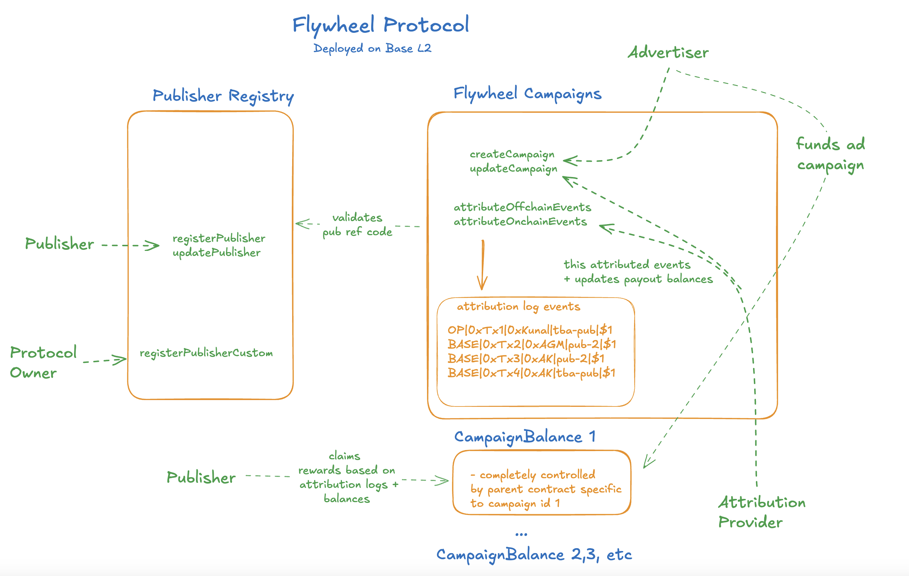

# Flywheel Protocol

For entire context of the project, please see latest version of Whitepaper [here](https://www.notion.so/spindlxyz/Flywheel-White-Paper-v0-3-192f736e3d4f804f995cfb54ae78a8ef). We experimented with different variations of implementations (including cross-chain communication with LayerZero, multi-payment support per campaign, etc.) but ultimately want to keep the onchain protocol straightforward for v1 while allowing publishers, attribution providers & advertisers to keep the main features they expect in an ad network.

The ultimate goal of protocol is to create a permissionless and transparent system for attribution and monetization of advertising in web3.

Initially the plan is to deploy on Base L2 in the near future. If the industry trends changes and there will be a need to deploy on other L2s in the midterm, we will highly consider it.

## Audit

We worked with [Macro](https://0xmacro.com/) to audit the protocol roughly in November. Since then, we added 2-3 minor features and fixed gas optimization and low risk nits.

## Getting Started

#### Clone

We use Git submodules, so be sure to clone both this repo and the linked submodules:

```
git clone --recurse-submodules -j8 https://github.com/spindl-xyz/spindl-protocol.git
```

#### Installation

1. We use foundry. Please install it by following the instructions [here](https://book.getfoundry.sh/getting-started/installation)

#### Testing

- We test and build using foundry
- coverage is close to 100%

```shell
forge build # to build the project

forge test -vv # for all tests

forge test --match-test testFuzz_cannotOverattribute_both_token_types -vv # for a specific test

forge test --match-test test_registerPublisherCustom -vvv # for a specific test. very verbose. great for debuging events

forge test --match-contract FlywheelCampaignsTest -vv # for a specific contract

forge test --gas-report --match-test test_benchmark_100  # to see gas usage for all contracts

forge coverage --ir-minimum # basic coverage report

### 1. Detailed Line by Line Coverage Report
forge coverage --ir-minimum --report lcov # detailed line by line coverage report
### 2. Get HTML report
genhtml lcov.info -o coverage-report --rc derive_function_end_line=0 genhtml --ignore-errors missing,missing,category
```

## Prettier Formatting

We have .prettierrc file that defines very basic coding format for the repo in solidity

Please make sure to use prettier plugin in cursor/vscode and `.vscode/seetings.json` should be handle the formatting from there

## Protocol Overview & Architecture

The main participants in the protocol are:

- `Attribution Providers`: these are the entities that will be providing attribution for the campaigns.
- `Advertisers`: these are the entities that will be creating campaigns and sending funds to them.
- `Publishers`: these are the entities that will be promoting the campaigns and earning funds from them.
- `Users`: these are the people that got converted via Publisher's traffic as a result of the campaign

There are 3 main contracts:

### FlywheelCampaigns

- this is the main contract that advertisers, publishers and attribution providers will interact with
- Advertisers can create campaigns (which triggers the creation of a `CampaignBalance` contract)
- selected Attribution Providers can write onchain & offchain attribution events & manage certain states of campaigns
- Publishers as well as Referents (person that clicked on an ad and got a 1 USDC reward for converting) can claim their rewards via `claimRewards`
- all of the campaign states are managed here
- when this constract is initialized, it can optionally accept PublisherRegistry address. for our Base L2 launch, this will be the case. This is done to verify that publisher ref codes that are provided during attritbuion are valid

### CampaignBalance

- this contract is responsible for holding the balance of native ETH or ERC20s for a given campaign
- it is strictly linked to a campaign created by `FlywheelCampaigns` and controlled by it

### PublisherRegistry

- this contract is responsible for registering publishers and keeping track of their inventory and payout addresses
- a signer address is available during instantiating of contract so that we can have our backend execute `registerPublisherCustom` method
- Attribution Providers use this contract to get the payout address for a given publisher
- Advertisers can use this as a reference to allowlist publishers for their campaigns

### Simplified Diagram



### Basic Flow of Protocol

- Both `PublisherRegistry` and `FlywheelCampaigns` are upgradeable contracts that will be owned by Flywheel protocol multisigs.
- For Base L2 deployment, we will provide Publisher Registry address so our `FlywheelCampaigns` can validate publisher ref codes. If we deploy FlywheelCampaigns to other L2s, we will likely not provider this address as we want `PublisherRegistry` to have one source of truth
- the multisig owner has minimal permissions for the protocol such as:
  - whitelist erc20 tokenAddresses that can be used for payments
  - update protocol fee via `updateProtocolFee`
  - update treasury address via `updateTreasuryAddress`
  - create custom publisher refCodes via `registerPublisherCustom` (we don't want to make this permissionless as it can lead to abuse)
  - upgrade the `PublisherRegistry` and `FlywheelCampaigns` contracts via `upgradeTo`
- `CampaignBalance` is deployed by `FlywheelCampaigns` each time a campaign is created via `createCampaign` and fully controlled by it. it is responsible for holding the balance of native ETH or ERC20s for a given campaign. No events are emitted from `CampaignBalance` contract & are only accessible for execution by `FlywheelCampaigns`

#### PublisherRegistry Section

##### Registering Publishers

1. Publishers can openly register via `registerPublisher` without any permissions checks

- this will generate a unique `refCode` which is used for a few reasons:

  - we decided to go with a refCode because we needed a url friendly short identifier for publishers.
  - publishers can use this refCode in a URL to identify themselves when driving traffic to the desired advertiser's outcome
  - Attribution Providers will use this refCode to attribute events to the correct publisher when they write events via `attributeOnchainEvents` & `attributeOffchainEvents`
  - advertisers can use this refCode to allowlist publishers for their campaigns

- **RefCode Generation**: refCodes are 8-character strings generated using keccak256 hash of an incrementing `nextPublisherNonce` counter (starting at 1), then encoded to base36 (0-9, a-z). The system automatically finds the next unique refCode by incrementing the nonce until an unused refCode is found.

2. Additionally Flywheel protocol owner (multisig) and assigned signer address can create custom refCodes for publishers via `registerPublisherCustom` if needed.

- this allows specifying a custom refCode (e.g., "spindl", "company") instead of using the auto-generated one
- this is useful for publishers that want their company name as a refCode & we don't want to leave this as a permissionless process in case of abuse
- function validates that the custom refCode isn't already taken before registration

3. Publishers can update their payout addresses and metadata info at any point via `updatePublisherDefaultPayout` & `updateMetadataUrl` & `updatePublisherOverridePayouts`

#### FlywheelCampaigns & CampaignBalance Section

##### Registering Attribution Providers

2. Before starting a campaign, Attribution Providers must register themselves via `registerAttributionProvider` (in `FlywheelCampaigns`)

- they will be assigned a unique id which advertisers will use to specify which attribution provider to use in the ad campaign.
- initially only Spindl will be the verified attribution provider. Anyone will be able to register but Advertisers will only work with trusted Attribution Providers. Once we do a soft launch that is successful, we will consider recommending other Attribution Providers that will attribute correctly
- each attribution provider has an owner & signer addresses.

  - we recommend owner address to be a multi-sig that shouldn't ideally change. this address cannot be updated. If lost, a new attribution provider can be registered with a new address.
  - signer address should be a secure signing address that will be used to sign offchain events on the backend. if this is compromised or changed, owner of Attribution Provider record can update it via `updateAttributionProviderSigner`

##### Creating Campaign

3. Advertisers create a campaign via `createCampaign` (in `FlywheelCampaigns`) with the desired parameters conversion configurations. We will support popular ERC20s and native ETH for payments

- this is also where Advertisers can specify the `attributionProviderId` for the campaign
- if wanting to use native ETH, the `tokenAddress` should be set to `address(0)`
- Campaign status is initially set to either `CREATED` or `CAMPAIGN_READY` depending on the `_setToCampaignReady` flag. Advertiser can set to `CAMPAIGN_READY` if they want to start receiving attribution events right away. If they want to wait until a specific time, they can set it to `CREATED` and then update the status to `CAMPAIGN_READY` at a later time.
- campaign creation will trigger the creation of a `CampaignBalance` contract which is used to hold the balance of the campaign.
- Advertiser can `deactivateConversionConfig` or `addConversionConfig` to modify an existing campaign that isn't COMPLETED yet.
- Advertisers can also set an allowlist of publisher ref codes for the campaign via `_allowedPublisherRefCodes` during campaign creation
  - this is useful if advertiser wants to only reward certain publishers for the campaign and deter others
  - if allowlist is not set, any publisher can be rewarded for driving conversions
  - if allowlist is set, we can only add more publishers to the allowlist via `addAllowedPublisherRefCode` but cannot remove them. This is to prevent abuse of the allowlist feature by advertisers.

##### Anatomy of Campaign & Conversion Configs

- references `struct Campaign` & `struct ConversionConfig` in `FlywheelCampaigns.sol`. this is what advertisers need to provider to setup for a campaign.

```solidity

struct CampaignCreationInputs {
 address _tokenAddress, // erc20 token address or address(0) as the payment type
  uint256 _attributionProviderId, // this will be id = 1 for most cases as Spindl Attribution Provider will be what most people use. we want to make this permissionless in case someone wants to use a different attribution provider.
  bool _setToCampaignReady, // if true, campaign will be set to CAMPAIGN_READY & campaign will start as soon as Attribution Provider activates it
  string memory _campaignMetadataUrl, // extra metadata. ie. creative assets, publisher ref code allow/deny lists, etc.
  ConversionConfigInput[] memory _conversionConfigs, // conversion configs for the campaign
  string[] memory _allowedPublisherRefCodes // allowlist of publisher ref codes for the campaign
}

 struct ConversionConfigInput {
  EventType eventType; // ONCHAIN or OFFCHAIN
  string eventName; // readable name for the conversion event. ie. "Page View", "Swap", "Deposit", "Mint", etc.
  string conversionMetadataUrl; // url to extra metadata necessary for tracking conversions
  uint256 publisherBidValue; // if rewardType=PERCENTAGE, value is between 0 and 10000 = %100.00. Otherwise, it is the flat fee amount
  uint256 userBidValue; // if rewardType=PERCENTAGE, value is between 0 and 10000 = %100.00. Otherwise, it is the flat fee amount
  RewardType rewardType; // FLAT_FEE, PERCENTAGE
  CadenceEventType cadenceType; // ONE_TIME or RECURRING
}
```

##### Funding Campaign & Checking Campaign Balance

4. Advertisers fund the campaign by sending the specified ERC20 or ETH to the `campaignBalanceAddress` address provided in the `createCampaign` call. This is the created `CampaignBalance` contract address.

- Advertisers don't have execute a specific function to add funds to a campaign. They simply add funds (ERC20 or ETH) to the `CampaignBalance` contract of their created campaign.
- Anyone can check the balance of any campaign at any point via several functions (in `FlywheelCampaigns`)
  - `getCampaignTotalBalance`: returns the remaining balance of the campaign _excluding_ any claimed rewards. I.e. 10K USDC was funded - 1K claimed = 9K remaining balance
  - `getCampaignTotalFunded`: returns the total amount funded to the campaign _including_ any claimed rewards. I.e. 10K USDC was funded

##### Activating Campaign & Writing Attribution Events

5. Once Attribution Provider is ready to attribute events for the campaign & only if campaign status is `CAMPAIGN_READY`, they can update the campaign status to `ACTIVE` via `updateCampaignStatus` (in `FlywheelCampaigns`)

6. Publishers can now start promoting the campaign.

7. Attribution Providers will write onchain & offchain attirbution events via `attributeOffchainEvents` & `attributeOnchainEvents` (in `FlywheelCampaigns`)

- if the protocol fee is > 0, treasury will receive a portion of the rewards
- only the Attribution Provider defined during campaign creation can write attribution events for the campaign
- if `publisherRegistryAddress` was defined during creation of `FlywheelCampaigns` contract, then we also validate that `publisherRefCode` exists

##### Anatomy of Attribution Event

- references `event OnchainConversion & OffchainConversion` in `FlywheelCampaigns.sol`. This is what attribution providers need to write to the protocol to be tracked correctly.

```solidity
struct Conversion {
  uint256 campaignId, // the campaign id that was created via `createCampaign`
  string publisherRefCode, // the publisher refCode that drove the conversion
  uint8 conversionConfigId, // the specific conversion config id that was used for the campaign
  bytes16 eventId, // a unique id for the event. we used bytes16 since it works nicely with postgres uuid type
  address payoutAddress, // the payout address that will receive the reward. this is the publisher's payoutAddress if recipientType is 1 (publisher) or the user's address if recipientType is 2 (user)
  uint256 payoutAmount, // the amount of the reward
  uint256 protocolFeeAmount, // the amount of the protocol fee. i.e. if original reward was 100 and protocol fee is 10%, then payoutAmount is 90 and protocolFeeAmount is 10
  uint8 recipientType, // the type of the recipient. 1 = publisher, 2 = user
  string clickId, // used to identify the campaign and other attributes of the click associated with the ad for ad tracking and campaign attribution
  uint32 timestamp, // unix timestamp of when the conversion event occurred (i.e swap happened on nov5, 2024)

  // **below fields are only for onchain events**
  address userAddress, // the address of the user that converted
  bytes32 txHash, //the txHash of the event
  uint256 txChainId, //  the chainId of the tx
  uint256 txEventLogIndex // the eventLogIndex of the tx
};
```

##### Claiming Rewards

8. Publishers & Users can claim their rewards via `claimRewards` (in `FlywheelCampaigns`)

- we distinguish between publishers & users as reciepientType 1 = publisher, 2 = user. we may add more types in the future. Publishers are the ones that drove traffic to the outcome. Users are the ones that converted (ie. an advertiser can create a campaign where they reward the publisher for driving conversions and giving a user a reward as well).

- Optionally, advertiser or Attribution Provider can push payments to publishers via `pushRewards` (in `FlywheelCampaigns`)
- If the protocol fee is > 0, treasury can claim protocol fee rewards via `claimProtocolFees`. they can pass a list of campaignIds because the rewards are tracked on a per-campaign basis.

9. Once Advertiser is ready to close the campaign, they can update the campaign status to `PENDING_COMPLETION`

10. Once all attribution events are written (in a few days typically), Attribution Provider can update the campaign status to `COMPLETED`

- We created this 2 step process so that Advertiser doesn't try to close the campaign before attribution is finalized (takes a few days typically)

11. Any remaining balance in the campaign can be withdrawn by Advertiser via `withdrawRemainingBalance`

12. Any remaining protocol fees can be claimed by treasury via `claimProtocolFees`

13. In addition, there are are chances where advertisers can accidentally deposit the wrong token to `CampaignBalance`. I.e. A USDC camapign was created but ETH or another ERC20 was deposited instead. In this case, advertiser can use the function `withdrawAccidentalTokens` to retrieve the wrong token at any time no matter the campaign state.

##### Anatomy of Rewards Tracking in Campaign

- references `Campaign` in `FlywheelCampaigns.sol`. this is what is tracked onchain for a given campaign. The way we think about rewards tracking is in a few terms:
- the goal is to track all the different balance, attribution states for both campaign & recipient (publisher & user) and to ensure that Attribution Provider cannot overattribute rewards.

```solidity
struct Campaign {
  // ... other fields

  // amount cumulatively attributed by attribution provider during `attributeOnchainEvents` & `attributeOffchainEvents`
  // if AP writes 100, then 200, then 300, then totalAmountAllocated = 600
  // also if Advertiser withdraws remaining balance, totalAmountAllocated is increased by the amount withdrawn as well
  uint256 totalAmountAllocated;
  // amount cumulatively claimed by publishers, users, & treasury via `claimRewards` or `pushRewards`
  // i.e. if recipient 0x123 claimed 50 & recipient 0x456 claimed 100, then totalAmountClaimed = 150 for that specific campaign
  uint256 totalAmountClaimed;
  // balance of protocol fees for the campaign that can be claimed by treasury via `claimProtocolFees`. when claimed, the balance is reset to 0
  uint256 protocolFeesBalance;
  // balance for each publisher & user that they can claim rewards for. when claimed, the balance is reset to 0
  mapping(address recipient => uint256 balance) payoutsBalance;
  // amount cumulatively claimed by each recipient. i.e. if user 0x123 claimed 50, then 100, then 50, then payoutsClaimed[0x123] = 200
  mapping(address recipient => uint256 claimed) payoutsClaimed;
}
```

### Campaign States

_Dictionary:_

- `only A` = only Advertiser can change this
- `only AP` = only Attribution Provider can change this
- `A & AP` = both Advertiser & Attribution Provider can change this
- `+AW` = Attribution Writing can happen in these states

#### 0. `NONE`

- solidity default state even if not defined

#### 1. `CREATED`

- requirements: `only A`, only from `NONE` state
- campaign has been created by advertiser. this is also a good time to fund the campaign altough we don't require it

#### 2. `CAMPAIGN_READY`

- requirements: `only A`, only from `CREATED` state
- Advertiser sets this to signify they are ready to pay for conversion events. This can also be set during campaign creation

#### 3. `ACTIVE`

- requirements:
  - from `CAMPAIGN_READY` state: `only AP`
  - from `PAUSED` state: `A & AP`
- campaign is set to active by Attribution Provider once they want to start running attribution events
- can be set back to this state if campaign is currently `PAUSED`
- `+AW` attribution writing can happen in this state

#### 4. `PAUSED`

- requirements: `A & AP`, only from `ACTIVE` state
- advertiser can pause the campaign if Campaign is `ACTIVE` to stop receiving new attribution events
- Attribution Provider can also set this state in case there is something wrong with the campaign
- `+AW` attribution writing can happen in this state

#### 5. `PENDING_COMPLETION`

- requirements: `only A`, only from `ACTIVE` or `PAUSED` state
- advertiser sets it to this state once they are ready to complete the campaign.
- `+AW` attribution writing can happen in this state

#### 6. `COMPLETED`

- requirement 1: `only AP`, only from `PENDING_COMPLETION` state
  - Attribution providers check if all events are attributed & set the campaign to processed. Advertisers can now withdraw any remaining balance from the campaign in this state
- requirement 2: `only A`, only from `COMPLETED` or `CAMPAIGN_READY` state
  - if advertiser creates & funds a campaign, but `AP` never activates it for any reason, advertiser will not be able to withdraw the campaign funds & campaign cannot be run. Therefore, until `AP` activates the campaign, advertiser can set the campaign to `COMPLETED` state to withdraw the funds in case there is a mistake with the `AP`.

## Deployment

Using forge to deploy & Verify (using etherscan)

- if you don't want to verify, remove the `--verify` flag

```shell

## Deploy UUPS FlywheelCampaigns
forge script scripts/DeployFlywheelCampaigns.s.sol \
   --rpc-url <your_rpc_url> \
   --etherscan-api-key <your_etherscan_api_key> \
   --broadcast \
   --verify


### Deploy UUPS PublisherRegistry
forge script scripts/DeployFlywheelPublisherRegistry.s.sol \
   --rpc-url <your_rpc_url> \
   --etherscan-api-key <your_etherscan_api_key> \
   --broadcast \
   --verify


### Deploy DummyERC20 (for testing only obviously)
forge script scripts/DeployDummyERC20.s.sol \
   --rpc-url <your_rpc_url> \
   --etherscan-api-key <your_etherscan_api_key> \
   --broadcast \
   --verify

```

## Gas Benchmarking

- this focused on attribution writing for 100 offchain & onchain events

```shell
# estimate USD cost based on hardcoded gas prices
forge test --match-test test_benchmark_100 --fork-url https://mainnet.base.org -vv

# Pure Gas Reports
forge test --match-test test_benchmark_100 --fork-url https://mainnet.optimism.io --gas-report # optimism
forge test --match-test test_benchmark_100 --fork-url https://mainnet.base.org --gas-report # base
forge test --match-test test_benchmark_100 --fork-url https://arb1.arbitrum.io/rpc --gas-report # arbitrum
```
